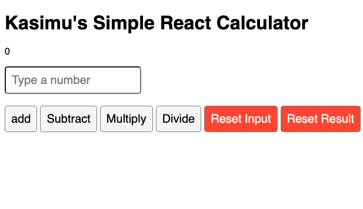

# Simple React Calculator

A basic calculator application built with React.



## Table of Contents

- [Description](#description)
- [Features](#features)
- [Usage](#usage)
- [Getting Started](#getting-started)
  - [Prerequisites](#prerequisites)
  - [Installation](#installation)
- [How to Use](#how-to-use)
- [Contributing](#contributing)
- [License](#license)

## Description

This is a simple React calculator that allows you to perform basic arithmetic operations: addition, subtraction, multiplication, and division. It also provides options to reset the input field and the result.

## Features

- Addition (+)
- Subtraction (-)
- Multiplication (\*)
- Division (/)
- Reset Input and Result

## Usage

### Getting Started

#### Prerequisites

Before you begin, ensure you have the following installed on your machine:

- [Node.js](https://nodejs.org/)
- [npm](https://www.npmjs.com/) (typically comes with Node.js)

#### Installation

1. **Clone Repository:** Clone this repository to your local machine:

   ```bash
   git clone https://github.com/shafihi/simple-react-calculator.git

   ```

2. **Navigate to Project:** Change your working directory to the project directory:

   ```bash
   cd simple-react-calculator

   ```

3. **Install Dependencies:** Install the project's dependencies using npm:

   ```bash
   npm install
   ```

### How to Use

1. **Start the Calculator:**

   - Start the development server:

     ```bash
     npm start
     ```

   - Open your web browser and visit [http://localhost:3000](http://localhost:3000).

2. **Using the Calculator:**

   - Use the calculator by typing numbers in the input field and clicking the operation buttons (add, subtract, multiply, divide). The result will be displayed below.

   - To reset the input field, click the "Reset Input" button.

   - To reset the result, click the "Reset Result" button.

   - Experiment with different calculations and enjoy using the Simple React Calculator!

### Contributing

Contributions are welcome! If you have any bug fixes, enhancements, or new features to add, please follow these steps:

1. Fork this repository.
2. Create a new branch for your feature: `git checkout -b feature-name`.
3. Commit your changes: `git commit -m "Add your feature description"`.
4. Push to your branch: `git push origin feature-name`.
5. Create a pull request explaining your changes.

Your contributions help improve this project for everyone.

### License

This project is licensed under the MIT License. You can find the full license text in the [LICENSE](LICENSE) file.
